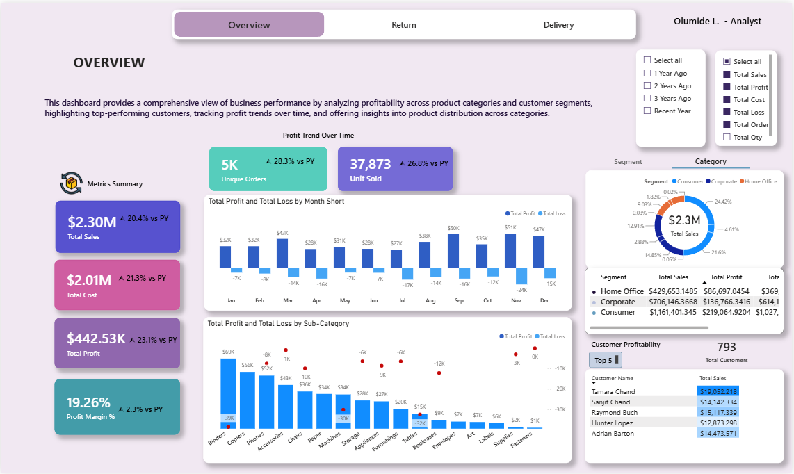
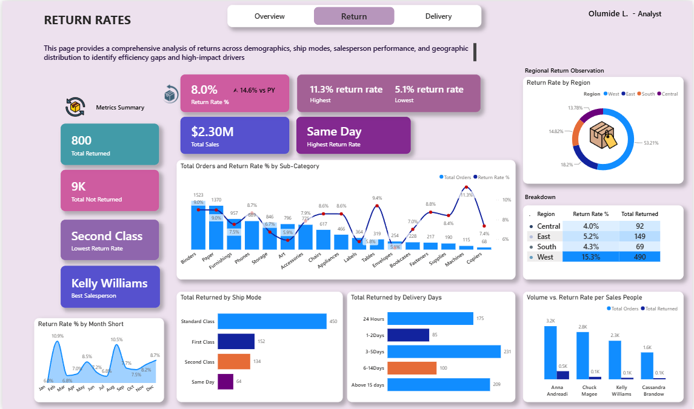
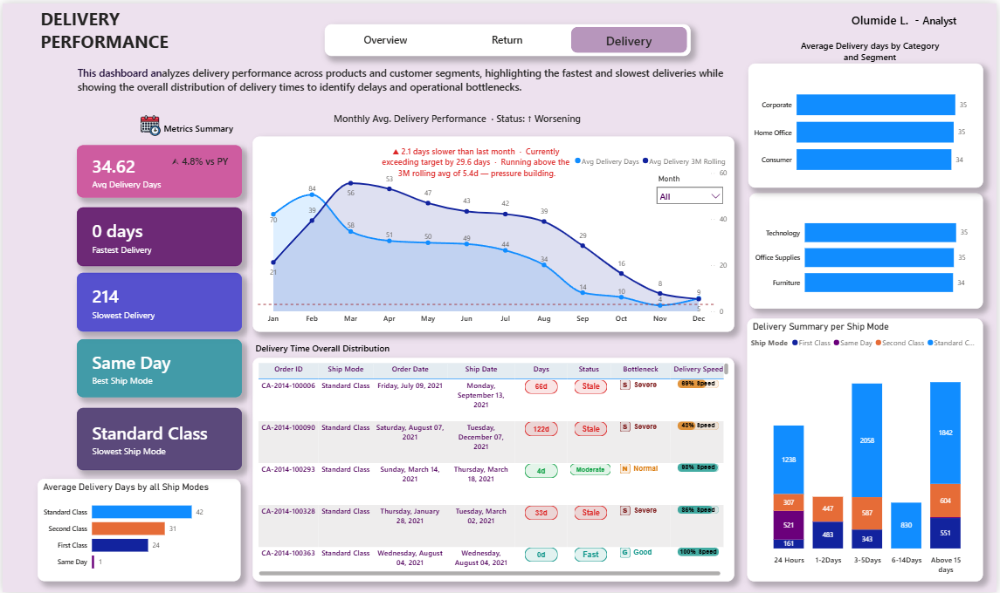

# From-Data-to-Decisions-Retail-Performance-Analysis
## Decoding  Sales, Profit Leakage, Delivery Bottlenecks, Trends &amp; Insights

- [Executive Summary](#executive-summary)
- [Project Overview](#project-overview)
- [Data Source](#data-source)
- [Problem Statement](#problem-statement)
- [Tools and Methodology](#tools-and-methodology)
- [Exploratory Data Analysis](#exploratory-data-analysis)
- [Key Insights](#key-insights)
- [Dahboard Preview](#dashboard-preview)
- [Recommendation](#recommendation)
- [Limitation](#limitation)
- [Conclusion](#conclusion)

  
### Executive Summary
Buzzy Retail Inc. operates a large-scale retail chain across North America serving three key customer segments: Consumer, Corporate, and Home Office. This report presents a comprehensive analysis of the company's retail sales data, covering delivery performance, profitability, product distribution, return rates, and supply chain management.

The analysis reveals that the company generated $2.30M in total revenue and $286K in total profit, achieving a profit margin of 12.47% across 9,994 orders and 37,873 units sold. Technology is the most profitable product category, while Standard Class shipping presents the most significant delivery bottleneck with an average of 42 days. The overall return rate stands at 8.0%, with Same Day delivery recording the highest return rate at 11.8%.

Key findings indicate that targeted interventions in shipping strategy, furniture profitability, and regional supply chain practices could significantly improve operational efficiency and bottom-line performance.

### Project Overview

Buzzy Retail Inc. is a leading retail chain operating across North America, with a diverse range of product offerings catering to various customer segments. The company has established a strong presence in the region, with retail outlets in major cities and metropolitan areas, priding itself on exceptional customer service and a seamless shopping experience.

This project analyzes operational and revenue performance across product categories and customer segments to uncover key factors influencing profitability, delivery efficiency, and customer return behavior. The analysis integrates transactional sales data, delivery timelines, product categories, and personnel performance metrics to provide stakeholders with actionable insights for strategic decision-making and business optimization. The management team commissioned this analysis to address the following core business challenges:

• Understanding which product categories and customer segments drive the most profit

• Identifying delivery bottlenecks and evaluating ship mode performance

• Assessing return rate drivers across ship modes, products, and sales personnel

• Evaluating supply chain efficiency at the regional and city level

• Developing actionable recommendations to improve operations and profitability

### Data Source
The dataset comprises 9,994 recorded retail transactions from Buzzy Retail Inc., covering a four-year period across multiple product categories and customer segments in North America. It is a transactional dataset encompassing structured attributes such as order details, product categories, customer segments, ship modes, delivery timelines, profit, sales revenue, discount rates, and return status.

### Problem Statement
Buzzy Retail Inc. faces a set of interconnected operational and commercial challenges that, if unaddressed, risk undermining profitability, customer satisfaction, and competitive positioning in the North American retail market. Stakeholders including operations managers, logistics teams, marketing leads, and executive leadership seek data-driven answers to the following critical questions:

1. Which product categories and customer segments generate the highest and lowest profits, and what strategies can maximize return on investment?
2. What are the key drivers of delivery delays across ship modes and product categories, and how can fulfillment speed be improved?
3. Why are customers returning products, which ship modes and sub-categories have the highest return rates, and what can be done to reduce return frequency?
4. Which sales personnel perform best in terms of return rate management, and how can their practices be replicated?
5. Which cities and states demonstrate the best supply chain management based on return rates, and what learnings can be transferred to underperforming locations?
6. Business Implication: Failing to answer these questions perpetuates delivery inefficiencies, leaves profitable customer segments underdeveloped, and results in avoidable revenue loss through high return rates and sub-optimal shipping strategies.

### Tools and Methodology
### Tools Used

#### Power Query - Data cleaning and validation

#### Power BI - Interactive dashboard development, DAX measures, and data modeling

### Methodology

### Data Cleaning & Preparation

The following data quality steps were performed to ensure analytical reliability:

Removal of duplicate order and transaction records to prevent inflated KPIs

1. Validation of date fields — Order Date and Ship Date — to ensure chronological integrity
2. Standardization of category names, ship mode labels, returned fields, and segment classifications
3. Enforcement of naming consistency across all tables and fields
4. Validation and correction of data types and formats to ensure compatibility with analytical operations
5. Identification and treatment of duplicate records across tables where necessary

### Data Transformation & DAX Measures

The following calculated metrics were developed in Power BI to support the analysis:

• Total Sales, Total Profit, Total Cost, Profit Margin % — core financial KPIs

• Return Rate % — DIVIDE(Total Returned, Total Orders) × 100

• Avg Delivery Days — AVERAGE of the Delivery Days calculated column

• RANKX measures — Top 5 customers, fastest/slowest products, best/worst salesperson

### Data Model

A star schema model was designed in Power BI by transforming the original retail order dataset (20+ columns) in Power Query into a structured data model. This involved creating a central Fact Table supported by multiple Dimension Tables, including Customer Location, Products, Ship Mode, and Salesperson.

One-to-many relationships were established between the fact table and each dimension table to ensure efficient data organization, improved query performance, and accurate aggregations during analysis.

### Dashboard Structure

Three interactive Power BI dashboard pages were developed to uncover the following business insights:

• Page 1 — Overview & Profitability: Revenue, profit, product distribution, top customers
• Page 2 — Delivery Performance: Ship mode analysis, bottleneck detection, delivery trend
• Page 3 — Return Analysis: Return rates by ship mode, salesperson, sub-category, and region
 
**Exploratory Data Analysis**

- Key Patterns
  
Initial analysis revealed clear performance concentration across the three product categories. Technology and Office Supplies consistently drove the majority of profit, while Furniture underperformed relative to its sales volume. Consumer segment orders represented the largest share of transactions but were closely followed by Corporate in profitability per order. 

- Distributions

Delivery days ranged from 0 (same-day fulfillment) to 214 days (extreme outlier). The majority of orders were fulfilled through Standard Class shipping, which also recorded the highest average delivery time of 42 days. Profit values ranged from a loss of -$6,600 to a peak of $8,400 per order, reflecting significant variance driven by discount depth and product category.

- Trends

Monthly profit trend analysis across 2021–2024 revealed a generally upward trajectory, with Q4 months consistently producing higher revenue and profit due to seasonal demand. The 3-month rolling average delivery days showed persistent elevation above the 5-day target threshold, confirming a structural logistics challenge rather than isolated delays.

- Outliers
  
A notable delivery outlier was identified: the Hewlett-Packard Deskjet D4360 Printer recorded an average delivery of 214 days, the single worst-performing product in the dataset. On the profit side, April 2017 recorded a monthly loss of -$5,890, driven by an unusual concentration of high-discount orders in that period.

- Correlations

Analysis identified the following directional relationships in the data:

• Higher discount rates and profit margins with negative or near-zero relationship, particularly in Furniture
• Same Day shipping, despite the fastest delivery, showed the highest return rate (11.8%), suggesting urgency-driven purchases carry higher return risk
• Salesperson return rates ranged from 4.0% to 15.3%, indicating significant performance variation that warrants knowledge-sharing initiatives
• States with 0% return rates consistently had lower order volumes, suggesting smaller customer bases

**Key Insights**

- Overview - Profitability Analysis

1. Technology is the most profitable category, generating $145.5K (50.8% of total profit), followed by Office Supplies at $122.5K (42.8%). Furniture contributes only $18.5K,  just 6.4% of total profit, despite representing a significant portion of the product catalog. This disproportionate underperformance signals deep margin compression in Furniture, likely driven by high discounting and elevated return rates.
2. The Consumer segment is the most profitable customer group, contributing $134.1K (46.8% of profit), followed by Corporate at $92.0K (32.1%). Home Office generates $60.3K (21.1%). All three segments have significant headroom for growth through targeted engagement strategies.
3. The top 5 customers by profit, Tamara Chand ($8,981), Raymond Buch ($6,976), Sanjit Chand ($5,757), Hunter Lopez ($5,622), and Adrian Barton ($5,445),  collectively represent a highly concentrated profit contribution. Losing even one of these customers would have a measurable impact on the bottom line. Retention strategies for this group should be a commercial priority.
4. Office Supplies dominates the product catalog with 1,087 unique SKUs, representing 62% of all products, yet generates only 42.8% of total profit. Technology, with the smallest SKU count at 271 products (15% of catalog), delivers the highest profit share at 50.8%. This inverse relationship between catalog depth and profitability in Office Supplies indicates that a curated, high-margin product strategy in Technology is significantly more efficient per SKU.

- Delivery Performance

1. Standard Class shipping accounts for the majority of orders yet records the worst average delivery performance at 41.9 days,  more than 46 times slower than Same Day shipping at 0.9 days. This concentration of volume in the slowest ship mode is the single largest operational bottleneck in the supply chain. 
2. Average delivery days are consistent across all three product categories (Technology: 35.5d, Furniture: 36.1d, Office Supplies: 34.0d) and all customer segments (~34–35 days each), confirming that ship mode selection, not product type or customer segment,  is the primary lever for improving fulfillment speed.
3. Monthly delivery trend analysis shows performance running above the 3-month rolling average for multiple consecutive months, with the dynamic insight brief flagging 'pressure building',  indicating that delivery delays are a structural trend rather than temporary spikes. 

- Return Rate Analysis
1. Same Day shipping records the highest return rate at 11.8%,  71% higher than Second Class at 6.9%. This is counterintuitive: despite being the fastest mode, Same Day generates the most returns. A likely explanation is that urgency-driven purchases made with Same Day delivery have lower deliberation time, leading to higher buyer's remorse and mis-fit orders. Improved product descriptions, size guides, and pre-purchase decision tools could reduce impulse returns.
2. Furniture records the highest category return rate at 9.5%, compared to Technology at 8.4% and Office Supplies at 7.6%. For a category already struggling with profitability (6.4% profit share), a 9.5% return rate compounds the margin challenge significantly. Sizing inaccuracies, assembly complexity, and unmet visual expectations are likely drivers.
3. At the sub-category level, Machines lead with an 11.3% return rate, followed by Tables at 9.4% and Binders at 9.0%. These high-return sub-categories warrant dedicated quality control reviews, enhanced product photography, and more detailed specifications to set accurate customer expectations prior to purchase
4. Kelly Williams records the lowest return rate of 4.0%,  less than half the company average of 8.0%. This exceptional performance suggests superior pre-sale customer qualification, accurate product recommendation, and thorough post-sale support. Kelly's approach should be formally documented and used as a knowledge-sharing model across the sales team.
5. Anna Andreadi records a return rate of 15.3%, nearly four times Kelly Williams' rate and almost double the company average. This significant gap indicates systemic differences in customer engagement or product matching quality. A structured coaching programme based on Kelly Williams' methodology is recommended.
6. Ten states, Arkansas, Connecticut, District of Columbia, Iowa, Kansas, Maine, Nevada, North Dakota, South Carolina, and Vermont,  all record a 0% return rate. While these states have lower overall order volumes, their zero-return performance indicates highly effective local supply chain execution: accurate order picking, quality verification, and reliable customer communication. These locations represent best-practice benchmarks that should be studied and scaled to underperforming regions. The West region records the highest return rate at 15.3% (490 returned orders), making it the highest-priority region for supply chain improvement intervention.

**Dashboard Preview** 

Three interactive Power BI dashboards were developed to present the findings of this analysis. Each page is designed to answer a specific set of business questions with KPI cards, dynamic visuals, and SVG badge indicators.
 
Page 1 — Overview & Profitability

Covers total revenue ($2.30M), total profit ($286K), profit margin (12.47%), and units sold (37,873). Includes a monthly profit trend chart, profit by category and segment visuals, top 5 customers table, and profit margin by sub-category bar chart. A dynamic profit insight card updates based on slicer selections.

 
Page 2 — Delivery Performance

Displays average delivery days (34.62), fastest delivery (0 days), slowest delivery (214 days), best ship mode (Same Day), and slowest ship mode (Standard Class). Features a monthly average delivery trend line chart with 3-month rolling average and dynamic insight brief. The delivery table visual includes SVG pill badges for Days, Status, Bottleneck Rating, and Speed Score per order.
 

 
Page 3 — Return Analysis

Shows overall return rate (8.0%), total returned orders (800), total not returned (9,194), lowest return ship mode (Second Class at 6.9%), highest return ship mode (Same Day at 11.8%), and best salesperson (Kelly Williams at 4.0%). Includes return rate by sub-category, ship mode, regional donut chart, salesperson performance visual, and a returns over time trend line.
 

**Recommendations**
 
The following recommendations are directly derived from the key insights identified in this analysis. Each recommendation is linked to a specific finding and includes an expected business impact.

1. Migrate Standard Class Volume to Faster Ship Modes
Standard Class accounts for the majority of orders with an average delivery time of 41.9 days — far exceeding the 5-10 day target. A tiered incentive programme encouraging customers to upgrade to Second Class or First Class shipping for time-sensitive orders would reduce average delivery days company-wide. Expected impact: 20–30% reduction in average delivery days for migrated orders.

2.  Introduce Pre-Purchase Friction for Same Day Orders
Same Day shipping's 11.8% return rate is the highest across all ship modes. Adding a confirmation step at checkout, such as a sizing guide prompt, product specification summary, or review screen,  for Same Day orders could reduce impulse purchases. Expected impact: 15–25% reduction in Same Day return rate, recovering margin on high-urgency orders.

3.  Review and Restructure Furniture Category Pricing
Furniture contributes only 6.4% of total profit despite accounting for 21% of the product catalog, and carries a 9.5% return rate, the highest of any category. A comprehensive pricing audit to reduce excessive discounting, combined with improved product photography and assembly guidance, would address both the margin and return challenges simultaneously. Expected impact: 3–5 percentage point improvement in Furniture profit margin within two quarters.

4.  Launch a Customer Retention Programme for Top 5 Customers
The top 5 customers collectively represent a disproportionate share of company profit. A dedicated account management programme, including early access to new products, loyalty pricing, and assigned relationship managers, would protect this revenue concentration. Expected impact: Reduced churn risk for the highest-value customer cohort, protecting an estimated $32,000+ in annual profit.

5.  Implement a Salesperson Coaching Programme Based on Kelly Williams' Practices
The 11.3 percentage point gap between the best (Kelly Williams, 4.0%) and worst (Anna Andreadi, 15.3%) salesperson return rates represents a clear operational opportunity. Formalising Kelly's customer qualification and product matching approach into a structured training module and deploying it across the full sales team would standardise performance. Expected impact: Reducing the team average return rate by 2–3 percentage points, translating directly into margin improvement.

6.  Deploy West Region Supply Chain Improvement Task Force
The West region records a 15.3% return rate, more than three times the rate of the Central region (4.0%). Deploying a cross-functional task force to audit West region fulfillment processes, benchmark against the 0%-return states, and implement quality control improvements would address the most concentrated return risk in the business. Expected impact: Reducing West region return rate to below 8.0% within 6 months, recovering approximately 200+ avoidable returns per year.

**Limitations** 
  
While this analysis provides meaningful and actionable insights, the following limitations must be acknowledged to ensure realistic interpretation of findings:
 
• Return reasons are not captured in the dataset. The analysis identifies where returns are highest but cannot definitively confirm why customers returned products without qualitative data.

• The Returned field is binary (Yes/Not), providing no granularity on partial returns, exchanges, or return timing relative to delivery.

• The 0% return rate states have lower order volumes and may not be directly comparable to high-volume regions in terms of operational scalability.

 
**Conclusion**

This report presents a comprehensive, data-driven evaluation of Buzzy Retail Inc.'s retail sales performance across four key dimensions: delivery efficiency, profitability, return rate management, and supply chain quality.
 
The analysis confirms that Buzzy Retail Inc. has a strong commercial foundation, $2.30M in revenue, a 12.47% profit margin, and growing year-over-year performance, but faces structural challenges in delivery speed, Furniture profitability, and return rate management in the West region that are suppressing its full potential.
 
By acting on the recommendations presented, the organization. is positioned to materially improve both operational efficiency and bottom-line profitability.
